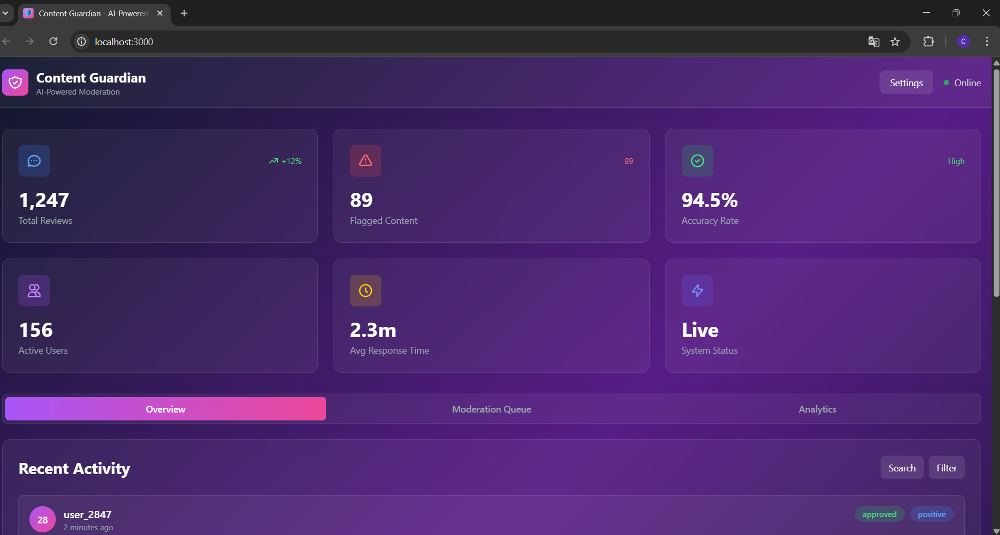

# 🛡️ Content Guardian

> AI-powered content moderation platform with real-time analysis, sentiment detection, and automated workflows.

[](https://vercel.com/new/clone?repository-url=https://github.com/Karlcamarodev/content-guardian)
[](https://nextjs.org)
[](https://www.typescriptlang.org)
[](https://tailwindcss.com)
[](https://content-guardian-five.vercel.app)
[](https://opensource.org/licenses/MIT)

---

## 🚀 Features

- ⚡ **Real-time Analysis** - Instant content moderation with AI
- 🤖 **AI-Powered** - Advanced machine learning algorithms
- 📊 **Sentiment Detection** - Analyze tone and context automatically
- 🎯 **Automated Workflows** - Set rules and let AI handle the rest
- 📈 **Analytics Dashboard** - Track moderation metrics in real-time
- 🔒 **Secure** - Enterprise-grade security and privacy
- 🌐 **Multi-language Support** - Moderate content in multiple languages
- ⚙️ **Customizable Rules** - Flexible moderation policies

---

## 🖼️ Preview



*Real-time content moderation dashboard with AI-powered analysis*

**🔗 Live Demo:** [content-guardian-five.vercel.app](https://content-guardian-five.vercel.app)

---

## 🛠️ Tech Stack

| Category | Technology |
|----------|-----------|
| **Framework** | Next.js 14 (App Router) |
| **Language** | TypeScript 5.0 |
| **Styling** | Tailwind CSS 3.4 |
| **UI Components** | Radix UI, shadcn/ui |
| **State Management** | React Hooks |
| **Analytics** | Vercel Speed Insights & Analytics |
| **Deployment** | Vercel |
| **Linting** | ESLint, Prettier |

---

## 📦 Installation

### Prerequisites

- Node.js 18.0 or higher
- npm, yarn, or pnpm

### Clone the repository
```bash
git clone https://github.com/Karlcamarodev/content-guardian.git
cd content-guardian
```

### Install dependencies
```bash
npm install
# or
yarn install
# or
pnpm install
```

### Run the development server
```bash
npm run dev
# or
yarn dev
# or
pnpm dev
```

Open [http://localhost:3000](http://localhost:3000) with your browser to see the result.

---

## 🚀 Build & Deploy

### Build for production
```bash
npm run build
npm start
```

### Deploy to Vercel

The easiest way to deploy is using the [Vercel Platform](https://vercel.com):

[](https://vercel.com/new/clone?repository-url=https://github.com/Karlcamarodev/content-guardian)

Or manually:
```bash
vercel
```

---

## 📂 Project Structure
```
content-guardian/
├── src/
│   ├── app/                 # Next.js App Router
│   │   ├── layout.tsx       # Root layout
│   │   ├── page.tsx         # Home page
│   │   ├── icon.tsx         # Dynamic favicon
│   │   └── dashboard/       # Dashboard pages
│   ├── components/          # React components
│   ├── lib/                 # Utilities and helpers
│   ├── styles/              # Global styles
│   │   └── globals.css      # Tailwind CSS
│   └── types/               # TypeScript types
├── public/                  # Static assets
│   └── images/             # Images and screenshots
├── .eslintrc.json          # ESLint config
├── tailwind.config.ts      # Tailwind config
├── tsconfig.json           # TypeScript config
└── package.json            # Dependencies
```

---

## 🎯 Key Features Explained

### 1. Real-time Content Analysis
AI analyzes content as it's submitted, providing instant feedback on potential issues.

### 2. Sentiment Detection
Advanced NLP models detect tone, intent, and emotional context in text content.

### 3. Automated Workflows
Create custom rules and let the system automatically moderate content based on your policies.

### 4. Analytics Dashboard
Monitor moderation metrics, trends, and performance in real-time with interactive charts.

---

## 🔧 Configuration

### Environment Variables

Create a `.env.local` file in the root directory:
```env
# App Configuration
NEXT_PUBLIC_APP_URL=https://content-guardian-five.vercel.app

# API Keys (if applicable)
# NEXT_PUBLIC_API_KEY=your_api_key_here
```

---

## 📊 Performance

- **Lighthouse Score:** 95+
- **First Load JS:** 87.3 kB (Excellent)
- **Bundle Size:** Optimized for production
- **Static Pages:** 4/4 pre-rendered
- **Build Time:** ~30 seconds

---

## 🤝 Contributing

Contributions are welcome! Please feel free to submit a Pull Request.

1. Fork the repository
2. Create your feature branch (`git checkout -b feature/AmazingFeature`)
3. Commit your changes (`git commit -m 'Add some AmazingFeature'`)
4. Push to the branch (`git push origin feature/AmazingFeature`)
5. Open a Pull Request

---

## 📝 License

This project is licensed under the MIT License - see the [LICENSE](LICENSE) file for details.

---

## 👨‍💻 Author

**Karl Camaro**

- GitHub: [@Karlcamarodev](https://github.com/Karlcamarodev)
- Twitter: [@karlcamaro1](https://twitter.com/karlcamaro1)
- Portfolio: [karlcamaro.dev](https://portfolio-rho-lemon-o164oascnv.vercel.app)

---

## 🙏 Acknowledgments

- Built with [Next.js](https://nextjs.org)
- Styled with [Tailwind CSS](https://tailwindcss.com)
- Deployed on [Vercel](https://vercel.com)
- Icons by [Lucide](https://lucide.dev)
- UI Components from [shadcn/ui](https://ui.shadcn.com)

---

## 📈 Roadmap

- [x] Core moderation features
- [x] Real-time analytics dashboard
- [x] Speed Insights integration
- [ ] Multi-language support
- [ ] Advanced reporting system
- [ ] Team collaboration features
- [ ] API for third-party integrations
- [ ] Mobile app (iOS/Android)
- [ ] Webhooks for custom integrations
- [ ] Machine learning model training interface

---

## 📸 Screenshots

### Dashboard Overview


### Analytics View
*Coming soon*

### Moderation Rules
*Coming soon*

---

## 🐛 Known Issues

No known issues at this time. Please report any bugs via [GitHub Issues](https://github.com/Karlcamarodev/content-guardian/issues).

---

## 📞 Support

If you have any questions or need help, feel free to:

- Open an [issue](https://github.com/Karlcamarodev/content-guardian/issues)
- Contact me on [Twitter](https://twitter.com/karlcamaro1)
- Email: karl.camaro@example.com

---

<div align="center">

**Made with ❤️ by Karl Camaro**

⭐ Star this repo if you find it useful!

[Report Bug](https://github.com/Karlcamarodev/content-guardian/issues) · [Request Feature](https://github.com/Karlcamarodev/content-guardian/issues)

</div>